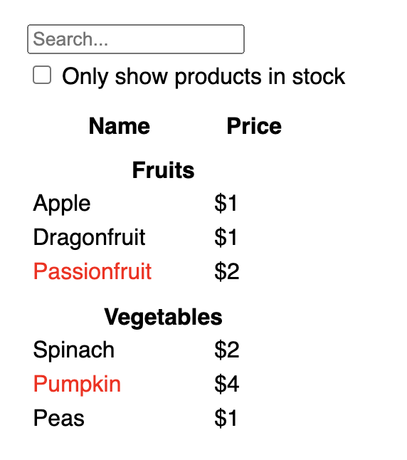

# A searchable product data table with React

### Start with the mockup

The mockup looks like this:

### Step 1: Break the UI into a component hierarchy

### Step 2: Build a static version in React

### Step 3: Find the minimal but complete representation of UI state

### Step 4: Identify where your state should live

### Step 5: Add inverse data flow
